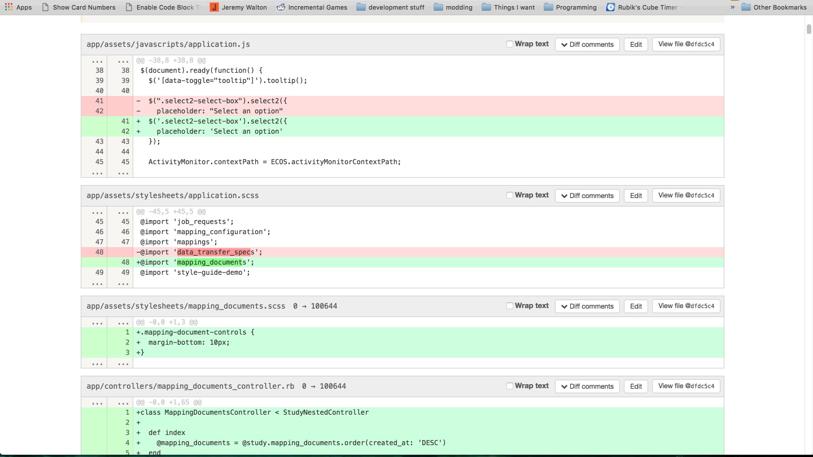

# Gitlab Code Review Block Toggle

Create a new bookmark and paste this as the link.

```js
javascript:(function()%7B%24(%27.diff-file%27).each(function(index,element)%7Bvar id%3D%27toggle-%27%2Bindex%3Belement.id%3Did%3Bvar js%3D"%24(%27%23"%2Bid%2B" .diff-content%27).toggle()%3B"%3Bvar button%3D%27<button onClick%3D"%27%2Bjs%2B%27">Toggle Visibility</button>%27%3B%24(element).prepend(button)%3B%7D)%3B%7D)()%3B
```


