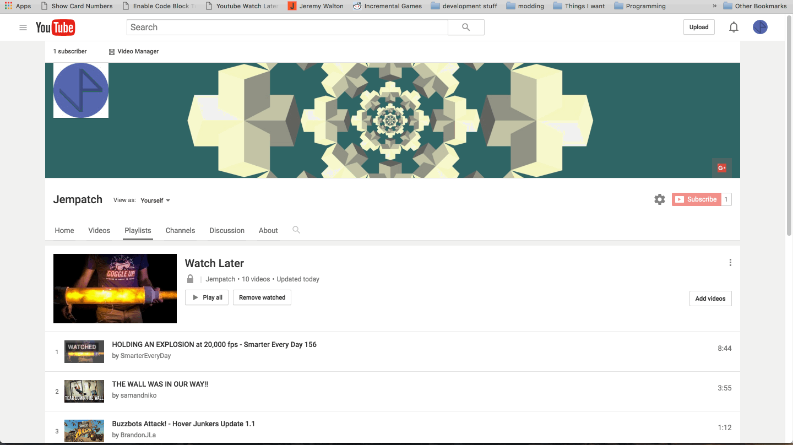

# Youtube Watch Later Time Calculator

Create a new bookmark and paste this as the link.

```js
javascript:(function()%7Bvar modulus%3Dfunction(n,m)%7Breturn((n%25m)%2Bm)%25m%3B%7D%3Bvar timer%3Dfunction()%7Btag.innerText%3Dtick%2B%27 %27%2BbaseText%3Btick--%3Bif(tick>-1)%7BsetTimeout(timer,1000)%3B%7D%7D%3Bvar stamps%3DArray.prototype.slice.call(document.getElementsByClassName(%27timestamp%27))%3Bvar zeroDate%3Dd2%3Dnew Date(%27Jun 22 2016 00:00:00%27)%3Bvar sum%3Dstamps.map(function(stamp)%7Breturn stamp.children%5B0%5D.innerText%3B%7D).map(function(time)%7Bif(time.length<6)%7Btime%3D%2700:%27%2Btime%3B%7Dvar date%3Dnew Date(%27Jun 22 2016 %27%2Btime)%3Breturn(date.getTime()-zeroDate.getTime())/1000%3B%7D).reduce(function(a,b)%7Breturn a%2Bb%3B%7D,0)%3Bvar hours%3Dmodulus(parseInt(sum/3600),24)%3Bvar minutes%3Dmodulus(parseInt(sum/60),60)%3Bvar seconds%3Dmodulus(sum,60)%3Bvar result%3D(hours<10%3F%270%27%2Bhours:hours)%2B%27:%27%2B(minutes<10%3F%270%27%2Bminutes:minutes)%2B%27:%27%2B(seconds<10%3F%270%27%2Bseconds:seconds)%3Bvar tag%3Ddocument.createElement(%27p%27)%3Bvar baseText%3D%27Total Playlist time: %27%2Bresult%3Btag.innerText%3DbaseText%3Btag.style.cssText%3D%27position: fixed%3B left: 50%25%3B top: 10px%3B z-index: 3000000000%3B padding: 10px%3B background-color: gray%3B%27%3Bdocument.body.appendChild(tag)%3BsetTimeout(function()%7Bdocument.body.removeChild(tag)%3B%7D,10000)%3Bvar tick%3D10%3Btimer()%3B%7D)()%3B
```


