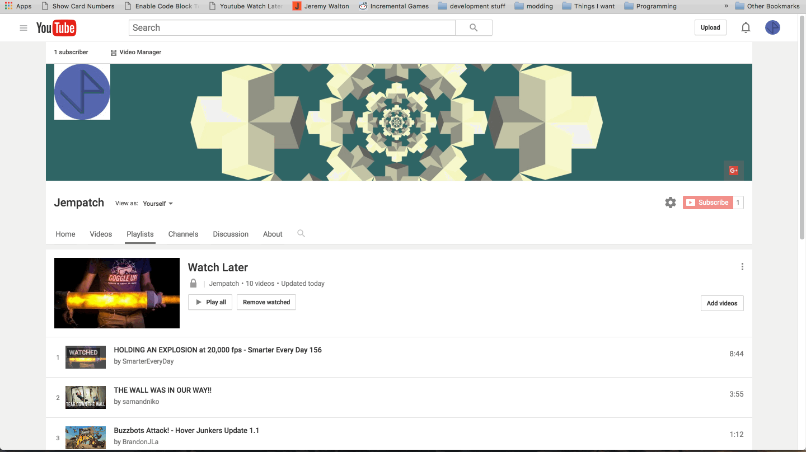

# Youtube Watch Later Time Calculator

Create a new bookmark and paste this as the link.

```js
javascript:(function()%7Bvar modulus%3D(n,m)%3D>((n%25m)%2Bm)%25m%3Bvar parsedTime%3Dtime%3D>time<10%3F%270%27%2Btime:time%3Bvar calculateTime%3Darray%3D>%7Bconst totalTime%3Darray.reduce(function(runningTotal,div)%7Bconst parts%3Ddiv.textContent.split(%27:%27).map(part%3D>parseFloat(part))%3Bif(parts.length<3)%7Bparts.unshift(0)%7Dreturn runningTotal%2B(parts%5B0%5D*3600)%2B(parts%5B1%5D*60)%2Bparts%5B2%5D%3B%7D,0)%3Bconst hours%3Dmodulus(parseInt(totalTime/3600),24)%3Bconst minutes%3Dmodulus(parseInt(totalTime/60),60)%3Bconst seconds%3Dmodulus(totalTime,60)%3Breturn %60 %24%7BparsedTime(hours)%7D:%24%7BparsedTime(minutes)%7D:%24%7BparsedTime(seconds)%7D%60%3B%7D%3Bvar timer%3D()%3D>%7Btag.innerText%3D%60%24%7Btick%7D%24%7BbaseText%7D%60%3Btick--%3Bif(tick>-1)%7BsetTimeout(timer,1000)%3B%7D%7D%3Bvar divs%3DArray.from(document.getElementsByClassName(%27timestamp%27))%3Bvar baseText%3D%60 Total Playlist Time:%24%7BcalculateTime(divs)%7D%60%3Bvar tag%3Ddocument.createElement(%27p%27)%3Btag.innerText%3DbaseText%3Btag.style.cssText%3D%27position: fixed%3B left: 50%25%3B top: 10px%3B z-index: 3000000000%3B padding: 10px%3B background-color: gray%3B%27%3Bdocument.body.appendChild(tag)%3Bvar tick%3D5%3BsetTimeout(()%3D>%7Bdocument.body.removeChild(tag)%3B%7D,tick*1000)%3Btimer()%3B%7D)()%3B
```


